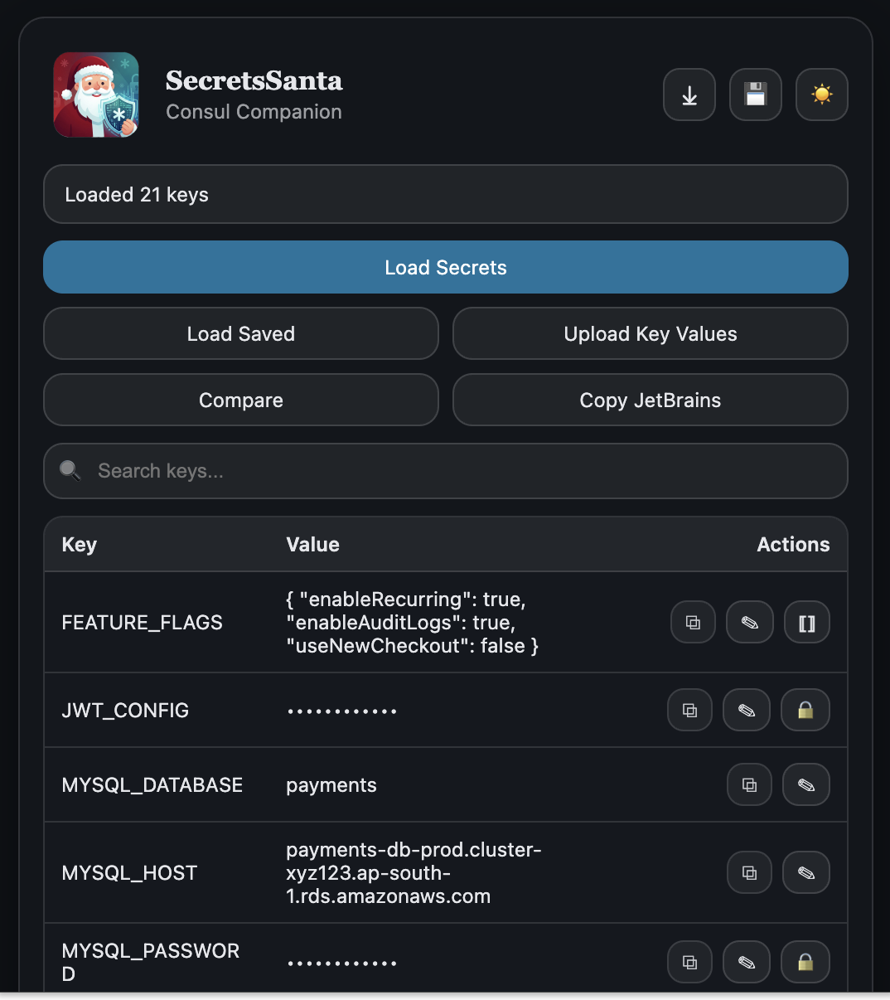
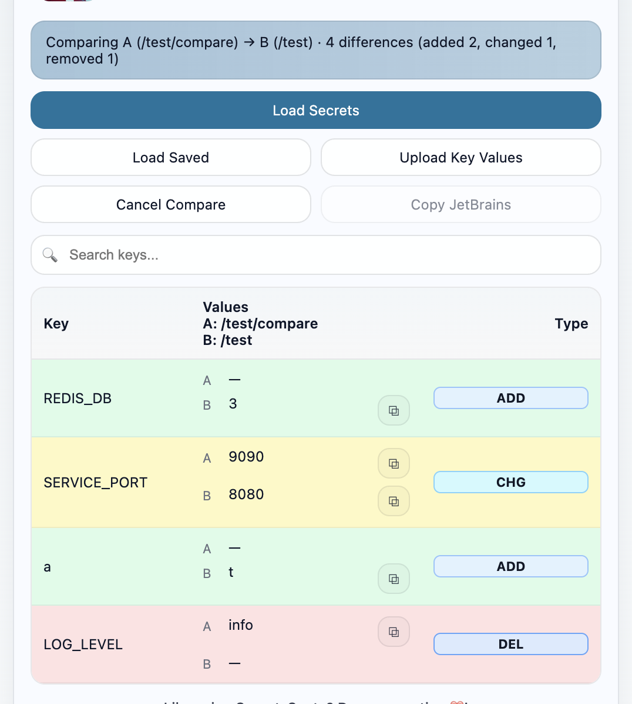

<p align="left"></p>

# 🎅 SecretsSanta

SecretsSanta is a Chrome extension that helps developers fetch, view, copy, and compare secrets stored in Consul KV — safely and effortlessly.

This is an open source initiative designed to make Consul KV management smoother for everyone.

## ✨ Features

- **Load & View**: Fetches keys/values from your current Consul KV page.
- **Auto-Auth**: Captures your Consul token automatically (no manual copy-paste).
- **Secure**: Values are masked by default. Copying always yields the raw value.
- **Edit & Upload**: Edit values inline or upload bulk keys via `.env` files or JetBrains format.
- **Compare**: Save snapshots of KV paths and diff them (e.g. Stage vs Prod).
- **Export**: Download keys as `.env` or copy in JetBrains format.
- **Modern UI**: Clean, responsive interface with a dark mode that respects your eyes.

## 🌐 Availability

SecretsSanta works on all Chromium-based browsers and Firefox.

- **Chrome**: [Install from Web Store](https://chrome.google.com/webstore/detail/secretssanta/placeholder)
- **Brave**: Compatible via Chrome Web Store.
- **Edge**: [Install from Edge Add-ons](https://microsoftedge.microsoft.com/addons/detail/placeholder)
- **Firefox**: [Install from Firefox Add-ons](https://addons.mozilla.org/en-US/firefox/addon/secretssanta/placeholder)

*(Note: Store links are placeholders until published. You can install manually using the steps below.)*

## 🔗 Project Links

- GitHub: https://github.com/ninadsutrave/secrets-santa

## 🚀 Getting Started

### Prerequisites

- **Git**: to clone the repository.
- **Node.js** (optional): strictly speaking not required to run the extension as it uses vanilla JS, but useful if you want to use any future build tools. Currently, the project is zero-dependency vanilla JS/HTML/CSS.

### Installation (Manual)

1.  Clone the repository:
    ```bash
    git clone https://github.com/ninadsutrave/secrets-santa.git
    cd secrets-santa
    ```

2.  **Chrome / Brave / Edge**:
    - Open `chrome://extensions` (or `edge://extensions`).
    - Enable **Developer mode** (top right toggle).
    - Click **Load unpacked**.
    - Select the `secrets-santa` folder you just cloned.

3.  **Firefox**:
    - Open `about:debugging#/runtime/this-firefox`.
    - Click **Load Temporary Add-on...**.
    - Select the `manifest.json` file from the cloned folder.

## 📖 Usage

1.  **Navigate** to a Consul KV path in your browser (e.g. `http://consul.local/ui/dc1/kv/my-service/`).
2.  **Open SecretsSanta** (Click the extension icon or press `Ctrl+Shift+S` / `Cmd+Shift+S`).
3.  **Load Secrets**: Click the button. If prompted, grant permission for the host.
4.  **Manage**:
    - Click `⧉` to copy values.
    - Click `✎` to edit inline.
    - Click `` to view/copy pretty-printed JSON.
    - Use **Upload Key Values** to bulk create/update keys.
    - Use the **Save** icon to snapshot the current view for later comparison.

## 🖼️ Preview
 
 <table>
   <tr>
     <td align="center">
       <br/>
       <sub>KV table view (mask, copy, edit, JSON)</sub>
     </td>
     <td align="center">
       <br/>
       <sub>Compare stage vs production key values</sub>
     </td>
   </tr>
 </table>

## 🧱 Build & Package (dist/)

Generate a clean, minified `dist/` folder with one JS per context:

1. Install tooling
   ```bash
   npm install
   ```
2. Build bundled dist
   ```bash
   npm run build
   ```
   Produces:
   - dist/popup.html (rewritten to one script)
   - dist/popup.js (single bundled, minified popup script)
   - dist/background.js (single bundled, minified service worker)
   - dist/styles.css
   - dist/assets/* (copied from assets/)
   - dist/manifest.json (based on root manifest, with corrected entry paths)

3. Zip the `dist/` folder
   ```bash
   npm run zip
   ```
   Creates SecretsSanta-dist.zip at project root.

4. Notes
   - Shortcut: set Cmd+Shift+S (mac) or Ctrl+Shift+S (Windows/Linux) in chrome://extensions/shortcuts for “Open SecretsSanta”.
   - Permissions and optional host permissions are taken directly from the root manifest.json.
   - Ensure icons exist under `assets/` and paths in `manifest.json` point to them.

## 🧭 Build Targets

- Chromium family
  - `npm run build:chromium` → outputs to `dist/chromium/`
- Firefox
  - `npm run build:firefox` → outputs to `dist/firefox/`
- Both
  - `npm run build:all`
- Packages
  - `npm run zip` → produces SecretsSanta-chromium.zip and SecretsSanta-firefox.zip
  - `npm run xpi:firefox` → produces SecretsSanta-firefox.xpi (for Dev/Nightly testing)

## 🛠️ Development & Contribution

We welcome contributions! This project is open source.

### How to Contribute

1.  **Fork** the repository on GitHub.
2.  **Clone** your fork locally.
3.  **Create a branch** for your feature or fix.
4.  **Make changes**: The codebase uses modular vanilla JavaScript (ES modules) in `src/popup/modules/`. No build step is required for development.
5.  **Lint your code**: Run `npm run lint` to ensure your changes comply with the project's code style. **All PRs must pass the CI linter to be merged into master.**
6.  **Test**:
    - Reload the extension in your browser (`chrome://extensions` -> click refresh icon on the card).
    - Verify functionality on a real Consul instance or a local dev agent (`consul agent -dev`).
7.  **Push** your branch and open a **Pull Request** to `https://github.com/ninadsutrave/secrets-santa`.

### Testing

Since this is a browser extension, testing is primarily manual:
- **Load**: Verify keys load correctly from a Consul page.
- **Token**: Ensure auth works without manual token entry.
- **CRUD**: Try editing a value and uploading a .env file.
- **Diff**: Save two different paths (e.g. `/app/dev` and `/app/prod`) and try the Compare feature.

### Local Testing (Consul UI)

1. Install Consul
   - macOS:
     ```bash
     brew install consul
     ```
   - Linux:
     - Debian/Ubuntu (using a package manager or downloaded binary):
       ```bash
       # If available via your package manager
       sudo apt-get update && sudo apt-get install consul || true
       # Or download a release and place the binary on PATH
       ```
     - Fedora/CentOS:
       ```bash
       sudo dnf install consul || sudo yum install consul || true
       ```
   - Windows:
     ```powershell
     winget install HashiCorp.Consul
     # or
     choco install consul
     ```

2. Start a local dev agent
   ```bash
   consul agent -dev
   ```
   - Opens the UI at http://localhost:8500/
   - For a sample key:
     ```bash
     consul kv put app/dev/HELLO world
     ```

3. Open the Consul KV page
   - Navigate to http://localhost:8500/ui/dc1/kv/app/dev/

4. Use SecretsSanta
   - Open the extension and click Load Secrets
   - If prompted, grant host permission for localhost:8500
   - When ACL is enabled, sign into the UI; the extension captures the session token automatically and lists keys for paths you open

## 📚 Docs & Policies

- Contributing: [CONTRIBUTING.md](./CONTRIBUTING.md)
- Code of Conduct: [docs/CODE_OF_CONDUCT.md](./docs/CODE_OF_CONDUCT.md)
- Security Policy: [docs/SECURITY.md](./docs/SECURITY.md)
- Privacy Policy: [PRIVACY.md](./PRIVACY.md)
- Changelog: [docs/CHANGELOG.md](./docs/CHANGELOG.md)
- Architecture: [docs/ARCHITECTURE.md](./docs/ARCHITECTURE.md)
- Reviewer Notes: [docs/REVIEWER_NOTES.md](./docs/REVIEWER_NOTES.md)

## 🔐 Security

- **Local Execution**: All logic runs locally in your browser.
- **No Analytics**: We do not track your usage or data.
- **Token Safety**: Your Consul token is stored in `chrome.storage.local` solely for making API calls on your behalf. It is never transmitted elsewhere.

## 📄 License

This project is licensed under the [MIT License](https://github.com/ninadsutrave/secrets-santa/blob/main/LICENSE).

## ✍️ Author

**Ninad Sutrave**  
[ninadsutrave.in](https://ninadsutrave.in)
